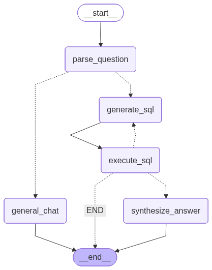

# 🛡️ SQL-Sentinel: Autonomous Text-to-SQL Agent

    

**SQL-Sentinel** is a production-grade AI Agent that converts natural language into secure, executable SQL queries. Unlike basic wrappers, this system employs a **StateGraph architecture** with self-correcting feedback loops, rigorous security safeguards, and schema-aware RAG pipelines.

> **Interact with your database using plain English:** *"Show me the top 5 customers by invoice total, and explain the trend."*

---

## 🏗️ Architecture
The system is built on **LangGraph**, orchestrating a directed cyclic graph (DCG) of specialized nodes.



*The workflow routes user intent, generates SQL, validates security, executes queries, and self-corrects errors in real-time.*

---

## 🚀 Key Features

### 1. 🧠 Self-Healing Workflows
The agent doesn't just fail; it learns.
* **Error Loop:** If a generated query fails (e.g., syntax error), the error is fed back into the `generate_sql` node. The LLM analyzes the specific SQLite error message and regenerates a corrected query in the next iteration.
* **State Management:** Utilizes `AgentState` to maintain chat history and error contexts across turns.

### 2. 🛡️ The "Sentinel" Security Layer
Built for real-world safety, not just demos.
* **Static Analysis:** `sentinel.py` uses regex blocking to reject DML operations (`DROP`, `DELETE`, `INSERT`), ensuring the agent is strictly **Read-Only**.
* **Context Safety Valve:** The execution engine enforces a `GLOBAL_CAP` (default: 50 rows) to prevent token overflow attacks from massive result sets.
* **Prompt Injection Defense:** System prompts explicitly instruct the LLM to return a `DML_ERROR` flag if coerced into modifying data.

### 3. ⚡ High-Performance RAG
* **Schema Pruning:** Dynamically retrieves only the relevant table schemas using `get_schema()` to reduce context window usage and hallucinations.
* **Groq LPU Acceleration:** Powered by **Llama 3 on Groq**, achieving sub-second query generation for real-time conversational latency.

---

## 🛠️ Technical Stack
* **Orchestration:** LangGraph, LangChain
* **LLM:** Llama 3 (via Groq API) for structured output.
* **Database:** SQLite (Chinook dataset).
* **Backend:** Python 3.10+, Pydantic (Data validation).
* **Frontend:** Streamlit.

---

## 💻 Installation & Setup

### 1. Clone the repository
```bash
git clone [https://github.com/RahulRocky0019/SQL-Sentinel.git](https://github.com/RahulRocky0019/SQL-Sentinel.git)
cd SQL-Sentinel
```

### 2. Install Dependencies
```bash
pip install -r requirements.txt
```

### 3. Set up Environment
Create a .env file in the root directory and add your Groq API key:
```bash
GROQ_API_KEY=gsk_your_actual_api_key_here
```

### 4. Run the Application
Run the Streamlit UI from the root directory:
```bash
streamlit run app/modules/sql_agent/ui.py
```

---

### 📂 Project Structure
```bash
SQL-Sentinel/
├── app/
│   ├── core/
│   │   └── config.py       # Config & Secrets
│   └── modules/
│       └── sql_agent/      # THE BRAINS
│           ├── graph.py    # StateGraph definition
│           ├── sentinel.py # Security logic
│           ├── state.py    # AgentState definition
│           ├── tools.py    # DB interactions
│           └── ui.py       # Streamlit Frontend
├── data/
│   └── chinook.db          # chinook.db
├── .env                    # Store GROQ_API_KEY
├── architecture_diagram.png
├── requirements.txt
└── README.md
```
